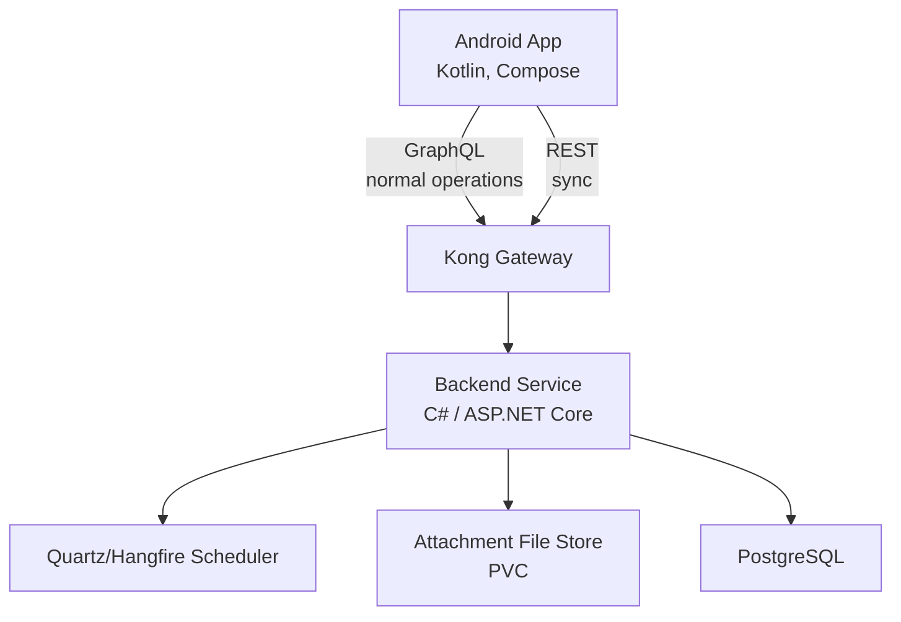

# Day Keeper App — Architecture & Data Model Plan (v1)

|              |                                                                                   |
| ------------ | --------------------------------------------------------------------------------- |
| **Status**   | Draft Baseline                                                                    |
| **Audience** | Personal project (single operator, multi-user capable)                            |
| **Goal**     | Scalable, offline-first, self-hosted life management platform with Android client |

---

## Table of Contents

1. Vision & Scope
2. High-Level Architecture
3. Technology Stack
4. Security Model
5. Sync Strategy
6. Notifications Strategy
7. Storage Strategy (Attachments)
8. Sharing & Authorization Model
9. Feature Specification (Locked v1)
10. Database Design Principles
11. Database Schema (Detailed)
12. Indexing & Performance
13. Future-Proofing Notes
14. Open Questions / Future Enhancements

---

## 1. Vision & Scope

## Primary Goals

- Personal life management system
- Offline-first mobile experience
- Multi-user capable from day one
- Fully self-hosted and free to operate
- Scalable and maintainable schema
- Support sharing of key resources

## Core Domains

- Calendar & events
- People & important dates
- Tasks & projects
- Lists (shopping)
- Attachments
- Notifications & reminders
- Background sync

---

## 2. High-Level Architecture



## Deployment Environment

- Local Kubernetes via **k3d**
- Public access via **Cloudflare Tunnel**
- Single gateway (Kong) for future services

---

## 3. Technology Stack

## Backend

- Language: **C# (.NET LTS)**
- Framework: **ASP.NET Core**
- ORM: **Entity Framework Core**
- Scheduler: **Quartz.NET** (or Hangfire)
- API Style:
  - GraphQL → interactive operations
  - REST → sync endpoints

## Mobile

- Language: **Kotlin**
- UI: **Jetpack Compose**
- Local DB: **Room (SQLite)**
- Networking: Retrofit/OkHttp or Ktor
- Background work: WorkManager
- Push: Firebase Cloud Messaging (FCM)

## Infrastructure

- Kubernetes: **k3d**
- Gateway: **Kong**
- Tunnel: **Cloudflare Tunnel**
- Database: **PostgreSQL**
- Attachment storage: **PVC-backed filesystem**

---

## 4. Security Model (Balanced)

## Included

- TLS in transit
- Auth + refresh tokens
- Device registration
- Encrypted host storage
- Kong as single exposed entry

## Not Included (by design)

- End-to-end encryption (deferred)
- Zero-knowledge server model

**Rationale:** trusted self-hosted environment.

---

## 5. Sync Strategy (Offline-First)

## Protocol Split

- **GraphQL**
  - CRUD operations
  - rich queries
- **REST**
  - `/sync/push`
  - `/sync/pull`

## Sync Requirements

All syncable tables include:

- `created_at`
- `updated_at`
- `deleted_at` (tombstone)

## Change Feed

- Global monotonic cursor
- Append-only `change_log`
- Client pulls by cursor

## Conflict Strategy (v1)

- Last-write-wins
- Room for future refinement

---

## 6. Notifications Strategy

## Model

### Server-driven push (FCM)

### Flow

1. Backend schedules reminders
2. Quartz/Hangfire triggers
3. Backend sends FCM
4. App displays notification
5. App performs background sync

## Optional (Client)

- Local custom reminders allowed
- Server remains source of truth

---

## 7. Storage Strategy — Attachments

## Approach: PVC-backed filesystem

### Why

- Fully free
- Simple operations
- Keeps Postgres lean
- Future migration to S3-compatible possible

## Supported Media Types (v1)

### Images

- image/jpeg
- image/png
- image/webp
- image/heic (optional)

### Documents

- application/pdf

### Not Supported (v1)

- video
- audio

## Phone Storage Policy

- Sync **metadata only**
- Download bytes on demand
- Local LRU cache
- Configurable size cap

---

## 8. Sharing & Authorization Model

## Core Concept: Spaces

A **space** is the fundamental sharing boundary.

Types:

- personal
- shared
- system

## Why Spaces

- Clean permission model
- Works across calendars, lists, projects
- Avoids per-entity ACL sprawl
- Future collaboration ready

## Roles

- owner
- editor
- viewer

Permissions enforced at space level (v1).

---

## 9. Feature Specification (Locked v1)

## Accounts & Devices

- Multi-user support
- Device registration
- Timezone preferences (synced, stored in accounts table)
- Week start preference (synced, stored in accounts table)

## User Preferences (Device-Local)

Stored in Android Preferences DataStore (not synced across devices).

### Display & UX

- Theme: system / light / dark (default: system)
- Default calendar view: month / week / day (default: month)
- Date format: system default / MM-DD-YYYY / DD-MM-YYYY (default: system)
- Time format: 12-hour / 24-hour / system default (default: system)
- List sort order: manual / alphabetical / date added (default: manual)
- Compact mode: on / off (default: off)

### Notifications

- Do not disturb window: start time / end time (default: 22:00–07:00, disabled)
- Default reminder lead time: none / 5min / 15min / 30min / 1hr / 1day (default: 15min)
- Notification sound: default / silent / custom (default: default)
- Per-category toggles: events (on) / tasks (on) / lists (on) / people (off)

## Calendar

- Multiple calendars per space
- Shared calendars supported
- Event types (system-defined)
- Holidays via system calendars
- Single events
- Recurring events
- Event location support
- Event reminders (multiple)

## People

- Contacts
- Contact methods (phone/email)
- Addresses
- Important dates (birthday, etc.)
- Attachments on people

## Tasks & Projects

- Shared projects
- Tasks inside or outside projects
- Recurring tasks
- Priority
- Categories (system + user)

## Lists (Shopping)

- Shared lists
- Items with:
  - decimal quantity
  - recommended unit OR freeform unit
  - checked state
  - ordering

## Attachments

Supported on:

- events
- tasks
- people

## Sync (v1)

- REST push/pull
- Tombstones
- Server cursor

## Notifications

- Server-driven via FCM
- Multiple reminders per item
- Future digest mode possible

---

## 10. Database Design Principles

## IDs

- UUID primary keys

## Time Handling

- UTC timestamps
- Explicit timezone fields

## Naming Uniqueness

Use normalized column:

```sql
lower(regexp_replace(trim(name), '\s+', ' ', 'g'))
```

Prevents:

- Appointment vs appointment
- whitespace variants

## Ownership

All major entities include:

- `tenant_id`
- `space_id`

---

## 11. Database Schema (Detailed)

### Type Conventions

- **Primary keys**: UUID stored as `TEXT` (36 chars)
- **Timestamps**: `INTEGER` (epoch milliseconds, UTC) — `created_at`, `updated_at` on all entities
- **Tombstone**: `deleted_at INTEGER` (nullable) on all syncable entities
- **Foreign keys**: `TEXT` referencing parent PK
- **Booleans**: `INTEGER` (0 = false, 1 = true)

### accounts

| Column       | Type    | Notes                                      |
| ------------ | ------- | ------------------------------------------ |
| tenant_id    | TEXT PK | UUID                                       |
| display_name | TEXT    |                                            |
| email        | TEXT    |                                            |
| timezone     | TEXT    | IANA timezone ID (e.g. "America/New_York") |
| week_start   | TEXT    | Enum: SUNDAY, MONDAY, SATURDAY             |
| created_at   | INTEGER | epoch millis                               |
| updated_at   | INTEGER | epoch millis                               |
| deleted_at   | INTEGER | nullable, tombstone                        |

### devices

| Column           | Type               | Notes                       |
| ---------------- | ------------------ | --------------------------- |
| device_id        | TEXT PK            | UUID                        |
| tenant_id        | TEXT FK → accounts |                             |
| device_name      | TEXT               |                             |
| fcm_token        | TEXT               | nullable until registered   |
| last_sync_cursor | INTEGER            | monotonic cursor, default 0 |
| created_at       | INTEGER            |                             |
| updated_at       | INTEGER            |                             |

### spaces

| Column          | Type               | Notes                            |
| --------------- | ------------------ | -------------------------------- |
| space_id        | TEXT PK            | UUID                             |
| tenant_id       | TEXT FK → accounts |                                  |
| name            | TEXT               |                                  |
| normalized_name | TEXT               | lowercase trimmed for uniqueness |
| type            | TEXT               | Enum: PERSONAL, SHARED, SYSTEM   |
| created_at      | INTEGER            |                                  |
| updated_at      | INTEGER            |                                  |
| deleted_at      | INTEGER            | nullable                         |

### space_members

| Column     | Type    | Notes                       |
| ---------- | ------- | --------------------------- |
| space_id   | TEXT    | composite PK with tenant_id |
| tenant_id  | TEXT    | composite PK with space_id  |
| role       | TEXT    | Enum: OWNER, EDITOR, VIEWER |
| created_at | INTEGER |                             |
| updated_at | INTEGER |                             |
| deleted_at | INTEGER | nullable                    |

### calendars

| Column          | Type               | Notes                      |
| --------------- | ------------------ | -------------------------- |
| calendar_id     | TEXT PK            | UUID                       |
| space_id        | TEXT FK → spaces   |                            |
| tenant_id       | TEXT FK → accounts |                            |
| name            | TEXT               |                            |
| normalized_name | TEXT               |                            |
| color           | TEXT               | hex color string "#RRGGBB" |
| is_default      | INTEGER            | boolean (0/1)              |
| created_at      | INTEGER            |                            |
| updated_at      | INTEGER            |                            |
| deleted_at      | INTEGER            | nullable                   |

### event_types

| Column          | Type    | Notes                                    |
| --------------- | ------- | ---------------------------------------- |
| event_type_id   | TEXT PK | UUID                                     |
| name            | TEXT    | e.g. "Meeting", "Appointment", "Holiday" |
| normalized_name | TEXT    |                                          |
| is_system       | INTEGER | boolean — system types can't be deleted  |
| color           | TEXT    | nullable, optional hex color override    |
| created_at      | INTEGER |                                          |
| updated_at      | INTEGER |                                          |

### events

| Column          | Type                  | Notes                                                |
| --------------- | --------------------- | ---------------------------------------------------- |
| event_id        | TEXT PK               | UUID                                                 |
| calendar_id     | TEXT FK → calendars   |                                                      |
| space_id        | TEXT FK → spaces      |                                                      |
| tenant_id       | TEXT FK → accounts    |                                                      |
| title           | TEXT                  |                                                      |
| description     | TEXT                  | nullable                                             |
| start_at        | INTEGER               | nullable, epoch millis — null if all-day             |
| end_at          | INTEGER               | nullable, epoch millis — null if all-day             |
| start_date      | TEXT                  | nullable, ISO date "2026-03-08" — for all-day events |
| end_date        | TEXT                  | nullable, ISO date — for all-day events              |
| is_all_day      | INTEGER               | boolean                                              |
| timezone        | TEXT                  | IANA timezone ID                                     |
| event_type_id   | TEXT FK → event_types | nullable                                             |
| location        | TEXT                  | nullable, freeform text                              |
| recurrence_rule | TEXT                  | nullable, RFC 5545 RRULE string                      |
| parent_event_id | TEXT FK → events      | nullable, for recurrence exceptions                  |
| created_at      | INTEGER               |                                                      |
| updated_at      | INTEGER               |                                                      |
| deleted_at      | INTEGER               | nullable                                             |

### event_reminders

| Column         | Type             | Notes                     |
| -------------- | ---------------- | ------------------------- |
| reminder_id    | TEXT PK          | UUID                      |
| event_id       | TEXT FK → events |                           |
| minutes_before | INTEGER          | e.g. 15, 60, 1440 (1 day) |
| created_at     | INTEGER          |                           |
| updated_at     | INTEGER          |                           |
| deleted_at     | INTEGER          | nullable                  |

### persons

| Column     | Type               | Notes    |
| ---------- | ------------------ | -------- |
| person_id  | TEXT PK            | UUID     |
| space_id   | TEXT FK → spaces   |          |
| tenant_id  | TEXT FK → accounts |          |
| first_name | TEXT               |          |
| last_name  | TEXT               |          |
| nickname   | TEXT               | nullable |
| notes      | TEXT               | nullable |
| created_at | INTEGER            |          |
| updated_at | INTEGER            |          |
| deleted_at | INTEGER            | nullable |

### contact_methods

| Column            | Type              | Notes                             |
| ----------------- | ----------------- | --------------------------------- |
| contact_method_id | TEXT PK           | UUID                              |
| person_id         | TEXT FK → persons |                                   |
| type              | TEXT              | Enum: PHONE, EMAIL                |
| value             | TEXT              | phone number or email address     |
| label             | TEXT              | "Home", "Work", "Mobile", "Other" |
| is_primary        | INTEGER           | boolean                           |
| created_at        | INTEGER           |                                   |
| updated_at        | INTEGER           |                                   |
| deleted_at        | INTEGER           | nullable                          |

### addresses

| Column      | Type              | Notes                   |
| ----------- | ----------------- | ----------------------- |
| address_id  | TEXT PK           | UUID                    |
| person_id   | TEXT FK → persons |                         |
| label       | TEXT              | "Home", "Work", "Other" |
| street      | TEXT              | nullable                |
| city        | TEXT              | nullable                |
| state       | TEXT              | nullable                |
| postal_code | TEXT              | nullable                |
| country     | TEXT              | nullable                |
| created_at  | INTEGER           |                         |
| updated_at  | INTEGER           |                         |
| deleted_at  | INTEGER           | nullable                |

### important_dates

| Column            | Type              | Notes                                |
| ----------------- | ----------------- | ------------------------------------ |
| important_date_id | TEXT PK           | UUID                                 |
| person_id         | TEXT FK → persons |                                      |
| label             | TEXT              | "Birthday", "Anniversary", or custom |
| date              | TEXT              | ISO date "2026-03-08"                |
| created_at        | INTEGER           |                                      |
| updated_at        | INTEGER           |                                      |
| deleted_at        | INTEGER           | nullable                             |

### projects

| Column          | Type               | Notes                  |
| --------------- | ------------------ | ---------------------- |
| project_id      | TEXT PK            | UUID                   |
| space_id        | TEXT FK → spaces   |                        |
| tenant_id       | TEXT FK → accounts |                        |
| name            | TEXT               |                        |
| normalized_name | TEXT               |                        |
| description     | TEXT               | nullable               |
| status          | TEXT               | Enum: ACTIVE, ARCHIVED |
| created_at      | INTEGER            |                        |
| updated_at      | INTEGER            |                        |
| deleted_at      | INTEGER            | nullable               |

### task_categories

| Column          | Type    | Notes               |
| --------------- | ------- | ------------------- |
| category_id     | TEXT PK | UUID                |
| name            | TEXT    |                     |
| normalized_name | TEXT    |                     |
| is_system       | INTEGER | boolean             |
| color           | TEXT    | nullable, hex color |
| created_at      | INTEGER |                     |
| updated_at      | INTEGER |                     |

### tasks

| Column          | Type                      | Notes                                    |
| --------------- | ------------------------- | ---------------------------------------- |
| task_id         | TEXT PK                   | UUID                                     |
| project_id      | TEXT FK → projects        | nullable — standalone tasks              |
| space_id        | TEXT FK → spaces          |                                          |
| tenant_id       | TEXT FK → accounts        |                                          |
| title           | TEXT                      |                                          |
| description     | TEXT                      | nullable                                 |
| status          | TEXT                      | Enum: TODO, IN_PROGRESS, DONE, CANCELLED |
| priority        | TEXT                      | Enum: NONE, LOW, MEDIUM, HIGH, URGENT    |
| due_at          | INTEGER                   | nullable, epoch millis                   |
| due_date        | TEXT                      | nullable, ISO date                       |
| recurrence_rule | TEXT                      | nullable, RFC 5545 RRULE                 |
| category_id     | TEXT FK → task_categories | nullable                                 |
| created_at      | INTEGER                   |                                          |
| updated_at      | INTEGER                   |                                          |
| deleted_at      | INTEGER                   | nullable                                 |

### shopping_lists

| Column          | Type               | Notes    |
| --------------- | ------------------ | -------- |
| list_id         | TEXT PK            | UUID     |
| space_id        | TEXT FK → spaces   |          |
| tenant_id       | TEXT FK → accounts |          |
| name            | TEXT               |          |
| normalized_name | TEXT               |          |
| created_at      | INTEGER            |          |
| updated_at      | INTEGER            |          |
| deleted_at      | INTEGER            | nullable |

### shopping_list_items

| Column     | Type                     | Notes                                                   |
| ---------- | ------------------------ | ------------------------------------------------------- |
| item_id    | TEXT PK                  | UUID                                                    |
| list_id    | TEXT FK → shopping_lists |                                                         |
| name       | TEXT                     |                                                         |
| quantity   | REAL                     | decimal, default 1.0                                    |
| unit       | TEXT                     | nullable, "pcs"/"kg"/"g"/"lb"/"oz"/"L"/"mL" or freeform |
| is_checked | INTEGER                  | boolean                                                 |
| sort_order | INTEGER                  | for manual ordering                                     |
| created_at | INTEGER                  |                                                         |
| updated_at | INTEGER                  |                                                         |
| deleted_at | INTEGER                  | nullable                                                |

### attachments

| Column        | Type               | Notes                                               |
| ------------- | ------------------ | --------------------------------------------------- |
| attachment_id | TEXT PK            | UUID                                                |
| entity_type   | TEXT               | Enum: EVENT, TASK, PERSON                           |
| entity_id     | TEXT               | FK to parent entity (polymorphic)                   |
| tenant_id     | TEXT FK → accounts |                                                     |
| space_id      | TEXT FK → spaces   |                                                     |
| file_name     | TEXT               | original filename                                   |
| mime_type     | TEXT               | image/jpeg, image/png, image/webp, application/pdf  |
| file_size     | INTEGER            | bytes                                               |
| remote_url    | TEXT               | nullable, server URL — null until synced            |
| local_path    | TEXT               | nullable, local cache path — null if not downloaded |
| created_at    | INTEGER            |                                                     |
| updated_at    | INTEGER            |                                                     |
| deleted_at    | INTEGER            | nullable                                            |

### sync_cursors

| Column       | Type    | Notes                     |
| ------------ | ------- | ------------------------- |
| id           | TEXT PK | single row, fixed ID      |
| last_cursor  | INTEGER | monotonic server cursor   |
| last_sync_at | INTEGER | epoch millis of last sync |

---

## 12. Indexing & Performance (Minimum Set)

Recommended indexes:

## Events

- (calendar_id, start_at)
- (calendar_id, start_date)

## Tasks

- (space_id, status, due_at)
- (space_id, status, due_date)

## Lists

- (list_id, is_checked, sort_order)

## Sync

- (tenant_id, id)
- (space_id, id)

## General

- (space_id, updated_at) on major tables

---

## 13. Future-Proofing Notes

This design intentionally supports:

- multi-user expansion
- richer sharing
- migration to object storage later
- advanced recurrence
- notification digests
- search indexing
- eventual E2E encryption if ever required
- multi-device sync at scale

---

## 14. Open Questions / Future Enhancements

Potential future work:

- Calendar-level permissions (currently space-level)
- Digest notification mode
- Full-text search
- Natural language event creation
- External calendar import (ICS)
- Advanced recurrence UI
- Attachment thumbnails
- Conflict resolution improvements
- Data retention policies
- Partitioning change_log if needed

---

## End of Baseline Plan
